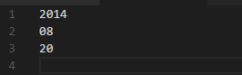
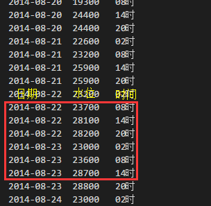

# [三峡水情官网](http://www.gridcn.com/inc/sqsk.php)三峡水情信息简单爬虫

很久之前写的小爬虫程序了，想当初也是受人所托跟`python`进行了第一次亲密接触，因为爬虫跟`python`结缘的怕不只是我一个人，今天整理代码的时候看到了，就把它上传到`github`上留个纪念。

## 简单说明

- 文件介绍
  - `date.txt` 设置爬取数据的起始日期，格式为年、月、日各占一行 脚本做了中断处理，当脚本非正常结束则会将当前爬取日期写入覆盖到这个文件，以备下次断点续爬。
  - ~~`spiderForCTG.py` 第一版的爬虫脚本，直接用正则匹配response的html代码，随着网站改版升级现已弃用。~~
  - `NewSpiderForCTG.py` 新版爬虫脚本，直接伪造`get`请求获取`ajax`数据，解析`ajax`为`python`对象，效率更高。
  - `三峡出库.txt` 结果示例
- 代码简介
  - 好像没啥好说的
